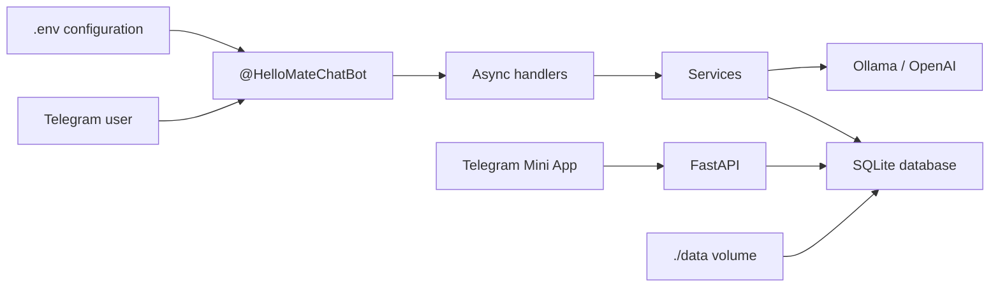

# HelloMate

**Open Source Telegram Companion Bot**

Telegram: [@HelloMateChatBot](https://t.me/HelloMateChatBot)

[](https://github.com/)
[](LICENSE)
[](https://www.python.org/)
[](Dockerfile)

HelloMate is an open-source Telegram companion bot for private chats. It supports daily greetings,
user settings, mood tracking, conversation memory, AI replies via Ollama or OpenAI-compatible APIs,
voice transcription, a Telegram Mini App dashboard, and a personal RAG knowledge base.

## Features

- Private 1-to-1 Telegram chat support
- Daily greetings with timezone-aware calendar logic
- Random conversation starters and scheduled proactive greetings
- Per-user settings, i18n (`ru`, `en`), and admin controls
- User profiles, mood tracking, and conversation memory
- AI replies via Ollama or OpenAI-compatible providers
- Voice message transcription and replies
- Telegram Mini App dashboard with FastAPI backend
- Personal RAG knowledge base via `/remember`
- SQLite persistence with versioned migrations
- Docker and Docker Compose deployment
- Python 3.12, async `python-telegram-bot`, Ruff, Black, and Pytest

## Architecture

HelloMate keeps Telegram-specific code thin and moves business behavior into testable services.
SQLite stores greetings, settings, profiles, mood, memory, and RAG documents.



## Quick Start

Requirements:

- Docker
- Docker Compose
- A Telegram bot token from [@BotFather](https://t.me/BotFather)

```bash
cp .env.example .env
nano .env
docker compose up -d --build
```

Set `BOT_TOKEN` in `.env`, then open a private chat with
[@HelloMateChatBot](https://t.me/HelloMateChatBot) or your own bot username.

## Docker Deployment

The Compose service is named `hellomate`, the container is named `hellomate-bot`, and the
database is stored in `./data` so it survives image rebuilds.

```bash
docker compose up -d --build
docker compose logs -f --tail=100
```

Optional Ollama service for local AI:

```bash
docker compose --profile ai up -d --build
docker compose exec ollama ollama pull llama3.2
```

Set in `.env`:

```bash
LLM_PROVIDER=ollama
LLM_BASE_URL=http://ollama:11434
AI_REPLIES_ENABLED=true
```

Stop the bot:

```bash
docker compose down
```

## VPS Deployment

1. Clone the repository on your server.
2. Install Docker and Docker Compose.
3. Create `.env` from `.env.example`.
4. Set `BOT_TOKEN` and optional `ADMIN_USER_IDS`.
5. Start the service with `docker compose up -d --build`.

For AI replies, either run the optional Ollama profile or point `LLM_PROVIDER=openai` at a cloud API.

For the Mini App dashboard, set `MINI_APP_URL` to your HTTPS URL (for example `https://your-domain.com/`)
and expose port `8080` behind a reverse proxy with TLS.

## Update From Git

Use the included production-friendly update script:

```bash
chmod +x update.sh
./update.sh
```

## Environment Variables

| Variable | Default | Description |
| --- | --- | --- |
| `BOT_TOKEN` | Required | Telegram bot token from BotFather |
| `TIMEZONE` | `Europe/Minsk` | Timezone used for daily greeting dates |
| `GREETING_TEXT` | `Привет друг! Как ты)` | Default greeting message |
| `DATABASE_PATH` | `/app/data/hellomate.db` | SQLite database path |
| `LOG_LEVEL` | `INFO` | Python logging level |
| `ADMIN_USER_IDS` | empty | Comma-separated Telegram admin user IDs |
| `DEFAULT_LANGUAGE` | `ru` | Fallback locale |
| `GREETING_HOUR` | `9` | Default proactive greeting hour (0-23) |
| `CONVERSATION_STARTERS` | `data/starters.json` | Path to starters JSON list |
| `MEMORY_WINDOW_SIZE` | `20` | Conversation memory window |
| `LLM_PROVIDER` | `ollama` | `ollama` or `openai` |
| `LLM_BASE_URL` | `http://localhost:11434` | LLM API base URL |
| `LLM_MODEL` | `llama3.2` | Chat model name |
| `LLM_EMBEDDING_MODEL` | `bge-m3:latest` | Embedding model for RAG (`/remember`) |
| `LLM_API_KEY` | empty | API key for cloud provider |
| `LLM_MAX_TOKENS` | `512` | Max response tokens |
| `AI_REPLIES_ENABLED` | `false` | Enable AI replies after greeting |
| `MINI_APP_URL` | empty | HTTPS Mini App URL |
| `API_HOST` | `0.0.0.0` | FastAPI bind host |
| `API_PORT` | `8080` | FastAPI bind port |
| `RAG_CHUNK_SIZE` | `500` | RAG chunk size in characters |
| `RAG_TOP_K` | `3` | Top chunks injected into prompts |
| `WEATHER_CITY` | `Minsk` | City for live weather lookups (Open-Meteo) |

## Commands

| Command | Description |
| --- | --- |
| `/start` | Welcome message and profile bootstrap |
| `/help` | Explains bot behavior |
| `/about` | Project information |
| `/lang` | Set language (`ru` or `en`) |
| `/profile` | View profile |
| `/setname` | Set display name |
| `/mood` | Record mood with inline buttons |
| `/moodhistory` | View recent mood entries |
| `/remember` | Save a note to your knowledge base |
| `/dashboard` | Open Telegram Mini App dashboard |
| `/admin` | Admin command help |
| `/settings` | View or set global bot settings |
| `/setlang` | Admin: set user language |
| `/setgreeting` | Admin: enable/disable user greetings |
| `/greetings` | Admin: list all greeting rules for a user |
| `/addgreeting` | Admin: add a greeting rule with its own text and schedule |
| `/delgreeting` | Admin: delete a greeting rule by number |
| `/togglegreeting` | Admin: enable/disable a greeting rule by number |
| `/setgreettext` | Admin: set legacy single greeting text (when no rules exist) |
| `/setgreetschedule` | Admin: set legacy single greeting schedule |
| `/setstarters` | Admin: enable/disable random conversation starters |
| `/sethour` | Admin: set user greeting hour |
| `/setpersona` | Admin: set full AI system prompt for a user |
| `/getpersona` | Admin: view effective AI system prompt for a user |
| `/userinfo` | Admin: inspect user settings |

Global bot setting `default_persona` (via `/settings set default_persona ...`) applies when a user has no custom persona.

Normal private text messages trigger the daily greeting check on the first message of the day.
After the greeting, AI replies are sent when `AI_REPLIES_ENABLED=true`.

## Local Development

```bash
python -m venv .venv
source .venv/bin/activate
pip install -r requirements.txt
cp .env.example .env
```

Run checks:

```bash
ruff check .
black --check .
pytest
```

Run the bot locally:

```bash
python -m app.main
```

## Roadmap Status

- Phase 1: daily greetings, SQLite, Docker
- Phase 2: conversation starters, scheduled greetings, admin settings, i18n
- Phase 3: profiles, mood tracking, conversation memory
- Phase 4: Ollama/OpenAI LLM replies, voice transcription
- Phase 5: Mini App dashboard, FastAPI, RAG knowledge base

## Contributing

Contributions are welcome. Please keep changes focused, add or update tests for behavior changes,
and run the local checks before opening a pull request:

```bash
ruff check .
black --check .
pytest
```

## License

HelloMate is released under the [MIT License](LICENSE).
