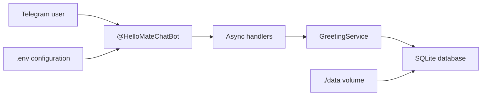

# HelloMate

**Open Source Telegram Companion Bot**

Telegram: [@HelloMateChatBot](https://t.me/HelloMateChatBot)

[](https://github.com/)
[](LICENSE)
[](https://www.python.org/)
[](Dockerfile)

HelloMate is an open-source Telegram companion bot for private chats. It starts with simple
daily greetings and is designed to evolve into a personal AI companion with memory, mood tracking,
voice messages, and local LLM integration.

## Features

- Private 1-to-1 Telegram chat support
- Ignores groups, supergroups, and channels
- Sends one friendly daily greeting per user
- Timezone-aware calendar day logic with `zoneinfo`
- `.env` configuration for Docker and local development
- SQLite persistence for greeting state
- Docker and Docker Compose deployment
- Python 3.12, async `python-telegram-bot`, Ruff, Black, and Pytest
- GitHub Actions CI

## Architecture

HelloMate keeps Telegram-specific code thin and moves business behavior into a testable service.
SQLite stores one record per user with the last date they received a greeting.



## Quick Start

Requirements:

- Docker
- Docker Compose
- A Telegram bot token from [@BotFather](https://t.me/BotFather)

```bash
cp .env.example .env
nano .env
docker compose up -d --build
```

Set `BOT_TOKEN` in `.env`, then open a private chat with
[@HelloMateChatBot](https://t.me/HelloMateChatBot) or your own bot username.

## Docker Deployment

The Compose service is named `hellomate`, the container is named `hellomate-bot`, and the
database is stored in `./data` so it survives image rebuilds.

```bash
docker compose up -d --build
docker compose logs -f --tail=100
```

Stop the bot:

```bash
docker compose down
```

## VPS Deployment

1. Clone the repository on your server.
2. Install Docker and Docker Compose.
3. Create `.env` from `.env.example`.
4. Set `BOT_TOKEN`.
5. Start the service with `docker compose up -d --build`.

For a small VPS, long polling is enough for Phase 1 and does not require exposing a public HTTP
endpoint.

## Update From Git

Use the included production-friendly update script:

```bash
chmod +x update.sh
./update.sh
```

The script pulls the latest code, rebuilds the Docker image, restarts the service, and follows the
latest logs:

```bash
git pull
docker compose down
docker compose up -d --build
docker compose logs -f --tail=100
```

## Environment Variables

| Variable | Default | Description |
| --- | --- | --- |
| `BOT_TOKEN` | Required | Telegram bot token from BotFather |
| `TIMEZONE` | `Europe/Minsk` | Timezone used for daily greeting dates |
| `GREETING_TEXT` | `Привет друг! Как ты)` | Message sent once per day |
| `DATABASE_PATH` | `/app/data/hellomate.db` | SQLite database path inside the container |
| `LOG_LEVEL` | `INFO` | Python logging level |

## Commands

| Command | Description |
| --- | --- |
| `/start` | Sends a friendly welcome message |
| `/help` | Explains the current Phase 1 behavior |
| `/about` | Shows project and open-source information |

Normal private text messages trigger the daily greeting check. If the user already received today's
greeting, the bot stays silent.

## Local Development

```bash
python -m venv .venv
source .venv/bin/activate
pip install -r requirements.txt
cp .env.example .env
```

Run checks:

```bash
ruff check .
black --check .
pytest
```

Run the bot locally:

```bash
python -m app.main
```

## Roadmap

### Phase 1

- Private chat daily greeting
- SQLite persistence
- Docker deployment

### Phase 2

- Random conversation starters
- Configurable greeting schedule
- Multi-language support
- Admin settings

### Phase 3

- User profiles
- Mood tracking
- Conversation memory

### Phase 4

- Ollama/local LLM integration
- AI-generated replies
- Voice message support

### Phase 5

- Telegram Mini App
- Personal dashboard
- RAG knowledge base

## Contributing

Contributions are welcome. Please keep changes focused, add or update tests for behavior changes,
and run the local checks before opening a pull request:

```bash
ruff check .
black --check .
pytest
```

## License

HelloMate is released under the [MIT License](LICENSE).
